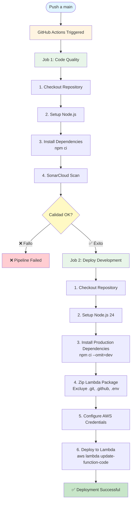

# 🚀 API Estática de Rick and Morty


API REST Monolito serverless que proporciona información sobre personajes de la serie Rick and Morty. Desplegada en AWS Lambda con arquitectura serverless, diseñada para alta disponibilidad y escalabilidad automática.

## 📋 Tabla de Contenidos

- [Características](#-características)
- [Tecnologías](#-tecnologías)
- [Arquitectura](#-arquitectura)
- [Prerrequisitos](#-prerrequisitos)
- [Instalación](#-instalación)
- [Uso Local](#-uso-local)
- [Despliegue](#-despliegue)
- [Endpoints](#-endpoints)
- [Estructura del Proyecto](#-estructura-del-proyecto)
- [CI/CD](#-cicd)
- [Contribución](#-contribución)

## ✨ Características

- ✅ API RESTful con Express.js
- ✅ Arquitectura serverless en AWS Lambda
- ✅ Logging estructurado con AWS Lambda Powertools
- ✅ CI/CD automatizado con GitHub Actions
- ✅ Análisis de calidad de código con **SonarCloud**
- ✅ Desarrollo local con Serverless Offline
- ✅ Escalabilidad automática y alta disponibilidad

## 🛠 Tecnologías

### Backend
- **Node.js 22.0.0** - Runtime de JavaScript
- **Express.js 5.0.0** - Framework web minimalista y flexible
- **TypeScript** - Superset de JavaScript con tipado estático
- **Serverless Framework 3.x** - Framework para despliegue serverless
- **serverless-http 4.0.0** - Adaptador para ejecutar Express en Lambda

### Infraestructura y Cloud
- **AWS Lambda** - Computación serverless
- **AWS API Gateway** - Gestión de APIs REST
- **AWS CloudWatch** - Monitoreo y logging

### Herramientas de Desarrollo
- **AWS Lambda Powertools** - Logger estructurado para Lambda
- **serverless-offline** - Emulador local de Lambda

### DevOps y Calidad
- **GitHub Actions** - CI/CD pipeline
- **SonarCloud** - Análisis estático de código y calidad
- **npm** - Gestor de paquetes

## 🏗 Arquitectura

### Diagrama de Arquitectura

```
┌─────────────────┐
│   API Gateway   │
│   (HTTP API)    │
└────────┬────────┘
         │
         ▼
┌──────────────────┐
│  AWS Lambda      │
│  ┌────────────┐  │
│  │ Express    │  │
│  │   App      │  │
│  └────────────┘  │
│  ┌─────────────┐ │
│  │  Logger     │ │
│  │(Powertools) │ │
│  └─────────────┘ │
└──────────────────┘
         │
         ▼
┌─────────────────┐
│   data.json     │
│(Datos estáticos)│
└─────────────────┘
```

### Pasos del Flujo Arquitectónico

1. **Cliente realiza petición HTTP** → API Gateway recibe la solicitud
2. **API Gateway enruta** → Invoca la función Lambda correspondiente
3. **Lambda procesa** → Express.js maneja el routing y lógica de negocio
4. **Logger registra** → Powertools captura contexto y métricas
5. **Respuesta** → Los datos se obtienen de `data.json` y se retornan al cliente

### Características Arquitectónicas

- **Serverless First**: Sin servidores que gestionar, escalado automático
- **Stateless**: Cada invocación es independiente
- **Event-Driven**: Respuesta a eventos HTTP a través de API Gateway
- **Microservicio**: API enfocada en un dominio específico

## 📦 Prerrequisitos

- **Node.js** >= 20.x
- **npm** >= 9.x
- **AWS CLI** (para despliegue manual)
- **Cuenta de AWS** con permisos para Lambda y API Gateway
- **GitHub** (para CI/CD)

## 🔧 Instalación

1. **Clonar el repositorio**
   ```bash
   git clone <repository-url>
   cd api.static.rick-and-morty
   ```

2. **Instalar dependencias**
   ```bash
   npm install
   ```

3. **Configurar variables de entorno** (opcional)
   ```bash
   # Crear archivo .env si es necesario
   STAGE=dev
   LOG_LEVEL=INFO
   ```

## 💻 Uso Local

### Desarrollo con Serverless Offline

Ejecuta la API localmente usando Serverless Offline:

```bash
npm run dev:less
```

La API estará disponible en `http://localhost:3000`

### Desarrollo con Node.js Watch

Para desarrollo con recarga automática:

```bash
npm run dev
```

### Ejecutar directamente

```bash
npm start
```

## 🚀 Despliegue

### Despliegue Automático (CI/CD)

El despliegue se realiza automáticamente cuando se hace push a la rama `main`:

1. **Análisis de Calidad**: SonarCloud analiza el código
2. **Build**: Se instalan dependencias de producción
3. **Package**: Se crea un ZIP con el código
4. **Deploy**: Se actualiza la función Lambda en AWS

### Despliegue Manual

```bash
# Instalar dependencias de producción
npm ci --omit=dev

# Desplegar con Serverless Framework
npx serverless deploy

# O desplegar solo la función
npx serverless deploy function -f api
```

### Variables de Entorno Requeridas

Configura los siguientes secrets en GitHub Actions:
- `AWS_ACCESS_KEY_ID`
- `AWS_SECRET_ACCESS_KEY`
- `AWS_REGION`
- `LAMBDA_NAME`
- `SONAR_TOKEN`

## 📡 Endpoints

| Método | Ruta | Descripción |
|--------|------|-------------|
| `GET` | `/` | Health check |
| `GET` | `/api/person` | Obtener todos los personajes |
| `GET` | `/api/person/:id` | Obtener personaje por ID |

### Ejemplos

**Health Check**
```bash
GET /
# Respuesta: 🚀 Deploy successfully
```

**Todos los personajes**
```bash
GET /api/person
# Respuesta: Array con todos los personajes
```

**Personaje específico**
```bash
GET /api/person/1
# Respuesta: { "id": 1, "name": "Rick Sanchez", ... }
# Error 404: { "error": "Person not found" }
```

## 📁 Estructura del Proyecto

```
api.static.rick-and-morty/
├── .github/
│   └── workflows/
│       └── deploy-lambda.yml    # Pipeline de CI/CD
├── src/
│   ├── app.js                   # Aplicación Express
│   ├── handler.js               # Handler de Lambda
│   ├── logger.js                # Configuración de logger
│   └── data.json                # Datos estáticos de personajes
├── .gitignore                   # Archivos ignorados por Git
├── package.json                 # Dependencias y scripts
├── serverless.yml               # Configuración de Serverless Framework
├── sonar-project.properties     # Configuración de SonarCloud
└── README.md                    # Este archivo
```

### Descripción de Archivos Clave

- **`src/app.js`**: Define las rutas y lógica de la API Express
- **`src/handler.js`**: Wrapper de Lambda que integra Express con el contexto de Lambda
- **`src/logger.js`**: Configuración del logger estructurado con AWS Lambda Powertools
- **`src/data.json`**: Base de datos estática con información de personajes
- **`serverless.yml`**: Configuración de infraestructura como código

## 🔄 CI/CD

El proyecto utiliza **GitHub Actions** para automatizar el proceso de despliegue con análisis de calidad mediante **SonarCloud**.

### Pasos del Pipeline

#### 1️⃣ Job: Code Quality (SonarCloud)
- ✅ **Checkout** del código fuente
- ✅ **Setup** de Node.js
- ✅ **Instalación** de dependencias (`npm ci`)
- ✅ **Análisis** de calidad con SonarCloud

#### 2️⃣ Job: Deploy (Development)
- ✅ **Dependencia**: Espera a que el análisis de calidad sea exitoso
- ✅ **Setup** de Node.js 24
- ✅ **Instalación** de dependencias de producción (`npm ci --omit=dev`)
- ✅ **Empaquetado** del código en ZIP
- ✅ **Configuración** de credenciales AWS
- ✅ **Despliegue** a Lambda (`aws lambda update-function-code`)

### Diagrama del Pipeline CI/CD



### Flujo Detallado del Pipeline

#### 🔵 Trigger
- **Evento**: Push a la rama `main`
- **Acción**: GitHub Actions inicia el workflow

#### 🟢 Job 1: Code Quality (SonarCloud)
1. **Checkout Repository** - Descarga el código fuente
2. **Setup Node.js** - Configura el entorno Node.js
3. **Install Dependencies** - Instala todas las dependencias (`npm ci`)
4. **SonarCloud Scan** - Ejecuta análisis de calidad de código
   - Detecta bugs y vulnerabilidades
   - Analiza code smells
   - Verifica duplicación de código

#### 🟡 Validación
- Si SonarCloud encuentra problemas críticos → ❌ Pipeline falla
- Si pasa la validación → ✅ Continúa al siguiente job

#### 🟢 Job 2: Deploy (Development)
1. **Checkout Repository** - Descarga el código fuente
2. **Setup Node.js 24** - Configura Node.js versión 24
3. **Install Production Dependencies** - Instala solo dependencias de producción
4. **Zip Lambda Package** - Crea paquete ZIP excluyendo:
   - Archivos `.git*`
   - Carpeta `.github/`
   - Archivos `.env`
   - Cache de `node_modules`
5. **Configure AWS Credentials** - Configura credenciales AWS desde secrets
6. **Deploy to Lambda** - Actualiza la función Lambda con el nuevo código

#### 🟢 Resultado Final
- ✅ Despliegue exitoso en AWS Lambda
- La función Lambda queda actualizada y lista para recibir peticiones

### SonarCloud

El proyecto utiliza **SonarCloud** para garantizar la calidad del código mediante:
- Análisis estático de código
- Detección de bugs y vulnerabilidades
- Code smells y deuda técnica
- Cobertura de código
- Duplicación de código

## 🧪 Testing

Actualmente el proyecto no incluye tests automatizados. Para agregar tests:

```bash
# Ejemplo con Jest
npm install --save-dev jest supertest
```

## 📝 Scripts Disponibles

- `npm start` - Ejecuta la aplicación directamente
- `npm run dev` - Desarrollo con watch mode
- `npm run dev:less` - Desarrollo con Serverless Offline
- `npm test` - Ejecuta tests (pendiente de implementar)

## 🔒 Seguridad

- ✅ No se exponen credenciales en el código
- ✅ Uso de secrets en GitHub Actions
- ✅ Validación de entrada en endpoints
- ✅ Logging estructurado sin datos sensibles

## 📊 Monitoreo

Los logs se envían automáticamente a AWS CloudWatch con:
- Contexto de la invocación Lambda
- Métodos HTTP y paths
- Nivel de log configurable (`LOG_LEVEL`)

## 🤝 Contribución

1. Fork el proyecto
2. Crea una rama para tu feature (`git checkout -b feature/AmazingFeature`)
3. Commit tus cambios (`git commit -m 'Add some AmazingFeature'`)
4. Push a la rama (`git push origin feature/AmazingFeature`)
5. Abre un Pull Request

### Estándares de Código

- Seguir principios SOLID
- Aplicar Clean Architecture
- Separación de responsabilidades
- Validación explícita de inputs
- Manejo de errores estructurado

## 📄 Licencia

Este proyecto está bajo la Licencia ISC.

## 👤 Autor

@SHELL7777

## 🙏 Agradecimientos

- [Rick and Morty API](https://rickandmortyapi.com/) por los datos de referencia
- AWS Lambda Powertools por las herramientas de observabilidad
- Serverless Framework por simplificar el despliegue serverless

---

⭐ Si este proyecto te resulta útil, considera darle una estrella en GitHub.
